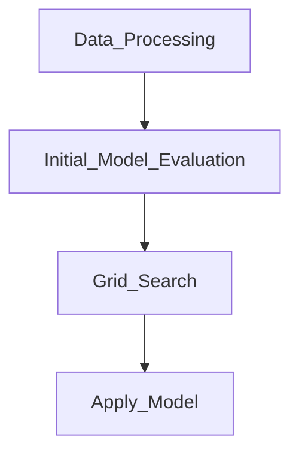

# Student Score Prediction

## Author
Prepared by Thomas Tay

## Overview
This project **Student Score Prediction** tries to identify potential student that may not do well in the final test. This machine learning model will predict the final test score and the teacher will focus additional resource on student that may not do well.

## Folder Structure
The zip file once expanded will have the following folder structure:
```css
.
├── AIAP Technical Assessment Past Years Series - Student Score Prediction.pdf
├── README.md
├── eda.ipynb
├── Dockerfile
├── requirements.txt
└── src
    ├── data (default is empty)
    │   ├── X_test.csv
    │   ├── X_train.csv
    │   ├── score.db
    │   ├── y_test.csv
    │   └── y_train.csv
    ├── pkl (default is empty)
    │   ├── best_ridge.pkl
    │   ├── best_decision_tree.pkl
    │   └── ...
    ├── log (default is empty)
    │   ├── data_processing_datetime.log
    │   ├── init_model_eval_datetime.log
    │   ├── gs_model_eval_datetime.log
    │   ├── apply_model_datetime.log
    │   └── ...
    ├── data_processing.py
    ├── initial_model_config.yaml
    ├── initial_model_eval.py
    ├── gs_config.yaml
    ├── gs_models_eval.py
    ├── apply_model_config.yaml
    └── apply_model.py
```
    
- The base folder contains the following files/folder:
    - Project document in PDF format.
    - This README file in markdown format.
    - An EDA file in Jupyter notebook format.
    - A docker file that allows user to build an image from it.
    - A requirement file that contains the installation requirement to be use together when building a container.
    - A src folder that contains the code and configuration file in Python and YAML file format.
-  The src folder contains the following folders and files:
    - **Folders** 
    - In addition to various python file, there are 3 folders that contains the data, pkl and log files.
    - data folder : This folder contains all the data related to this project.
    - pkl folder : This folder contains all the grid search parameters for each model.
    - log folder : For each run of the Python file, there is a log file created and store in the log folder.
    - **Python and Configuration Files**  
    - `data_processing.py` : Use this Python file to download the raw data and perform the necessary data cleaning and feature engineering.
    - `initial_model_config.yaml` : Use this file to perform all the configuration of the hyperparameters for initial model evaluation.
    - `initial_model_eval.py` : Use this file to run initial model evaluation. This is no grid search. Users can select which model to perform initial model evaluation.
    - `gs_config.yaml` : Use this config file to perform hyperparameters fine tuning for grid search.
    - `gs_models_eval.py` : Use this file to perform grid search. For each model, the best parameters are save into the pkl folder.
    - `apply_model_config.yaml` : Use this file to configure which model you want to apply to the datasets. You can also manually configure the parameters.
    - `apply_model.py` : Use this file to apply the best model to the training and test datasets.


## Setup and Installation 
It is recommended to use a container to setup the execution environment. A docker file is provided to build the container.

### Basic Requirements:
- Please have docker installed in the PC or virtual machine.
- The base requirement is Python 3.11. This requirement is specified in the docker file.
- Package requirement also included to work with the docker file.

Package Requirements:
```bash
scikit-learn==1.2.2
numpy==1.23.5
pandas==2.2.2
scipy==1.12.0
xgboost==2.1.2
pyyaml==6.0.2
```

### Step 1: Unzip the Package
Unzip the main zip file into a place where it is convenient to run with a container. Please navigate to the base folder where this README document resides.


### Step 2: Bulding a Container Environment
Before building the container, please ensure that docker is installed on the PC or VM and you are able to build an image from the command prompt.

The Docker file and the requirements file is included in the base folder. You need to build the docker image from the base folder.

To build a container image use the following code, replace the name of image with a name of your liking:
```bash
docker build -t <name-of-image> .
```

### Step 3: Running a Container Image
Please make sure that you are either at the base folder or src folder. To run the docker image, use the following command:
```bash
docker run -it --rm -v $(pwd):/app <name-of-image> 
```

- If you are in the base folder, you need to drill down to src folder to run all the evaluation program.

### Setup Guide for VM or Local Machine
If you are using other VM or local machine without docker, please follow the brief guide below. 

If you do not have any Python installed in your environment, please run the code below:
```bash
apt-get install python3.11 python3.11-venv python3-pip
```

Setting Up and Activate Virtual Environment for Python
```bash
# create a python virtual environment
python3.11 -m venv <path-env-name>
# activate the environment
source <path-env-name>/bin/activate
# To deactivate just type deactivate at the command prompt
```

Install the required Python packages. Please make sure that you navigate to the base folder where the requirement file reside.
```bash
# Navigate to the base folder first.
pip install -r requirements.txt
```

## ML Flow
The general flow of implemeting this project can be found below:


The following is a brief description of the ML flow, the execution details are provided under Execution Intructions.

1. First step is downloading and processing data. 
2. The next step is initial model evaluation. As grid search is resource intensive. We can explore all available models and its basic configuration at this stage. We can narrow down our search range before conducting grid search. 
3. The next step is grid search with cross validation fold. Depending on the complexity, you can choose to run multiple models or one model at a time.
4. The final step is to apply the best model on the training and test dataset.

**Note**: For each step, there will be a log file generated. 

**Note**: From step 2 to step 4, there will be a configuration file used to define model, pipeline and parameters.
 
## Instruction for Execution

### Step 1: Data Processing
Please use the following code for data processing, we need to run it from the src folder:

```bash
python data_processing.py
```

**Note** : All processing log will be stored in the log folder with prefix `data_processing` follow by datetime.

### Step 2: Initial Model Evaluation

The next step is to perform initial model evaluation, we can use this step to perform initial evaluation on various model. As performing grid search is resource intensive. We use this step to look at the basic result of various model. The configuration file `initial_model_config.yaml` allow us to set various parameters, so that we can look at the score of these parameters. As both the training score and cross validation score are printed. We can discover which parameters is overfitting. Please note that at this stage we only use the model score as the evaluation metrics.

#### Configuration Guide
There are 5 main configurations at `initial_model_config.yaml`. They are CV_SIZE, SAMPLE_SIZE, MODEL_LIST, MODELS and PARAMS.

- CV_SIZE : This allow us to set the size of the cross validation dataset.
- SAMPLE_SIZE : If your dataset is very large, you can reduce the size of the training dataset.
- MODEL_LIST : Use this setting to select which model to run. Only the models specfied here will be run.
- MODELS : Use this setting to construct the pipeline for each model.
- PARAMS : Use this setting to define which parameters to run for each model.
  
Please note that this is no grid search, you can set the parameters with a wide range. You can see the training score and test score for each combination. Use this tool to set a large range, look at the score for underfitting and overfitting. Narrow down the search parameters in preparation for grid search.


Setting the size of cross validation dataset. Best recommendation is to set between 0.1 to 0.3 depending on the overall data size. 
```python
# Define the size of cross validation dataset, range from 0.1 to 0.9
CV_SIZE : 0.2
```

If your dataset is very large, you can set the sample size so that we can reduce the data size. Please note that for the existing training dataset, the system will set aside the cross validation dataset first. Then the remaining will be use for training.
```python
# Define Sample size for large dataset
# If your dataset is very large, you can set the sample size
# Please note that the system will extract the CV dataset for testing first
# SAMPLE SIZE will only applied to the remaining training data after the CV Split
# Set from 0.1 to 1.0. 1.0 means not reducing teh dataset size.
SAMPLE_SIZE : 0.6
```

Selecting which model to process. This is a model pick list. We can select which model to evaluate by setting the model list. For larger dataset or complex model, it is best to use only one model in the list.
```python
# Define which model to run
# The MODELS_LIST will define which model to run so there is no need to delete any model configuration
#MODELS_LIST : ['polynomial', 'ridge', 'decision_tree', 'knn_regressor', 'svr', 'rf_regressor', 'bg_regressor', 'xgboost']
#MODELS_LIST : ['decision_tree','rf_regressor', 'bg_regressor', 'xgboost']
MODELS_LIST : ['decision_tree', 'knn_regressor', 'svr']
```

Configure the pipeline for each model, once the configuration is set, there is little need to change it. However, you can decide which model need polynomial features and feature scaling. You can also decide the type of feature scaling required for each model.  Currently, we only support StandardScaler and MinMaxScaler.
```python
# Define models pipelines that include polynomial features and scaling.
# For feature scaling we have StandardScaler and MinMaxScaler
MODELS : 
  'polynomial':
    - 'poly': PolynomialFeatures
    - 'scaler': StandardScaler
    - 'polynomial': LinearRegression
  'ridge':
    - 'poly': PolynomialFeatures
    - 'scaler': StandardScaler
    - 'ridge': Ridge
  'decision_tree':
    - 'decision_tree': DecisionTreeRegressor
  'knn_regressor':
    - 'poly': PolynomialFeatures
    - 'scaler': StandardScaler
    - 'knn_regressor': KNeighborsRegressor    
........
```

Setting hyperparameters:
We can also set the range of hyperparameters at a large range. The following is just some example:
```python
PARAMS : {
......
    'rf_regressor':{
        'rf_regressor__n_estimators': [500, 1000],
        'rf_regressor__max_depth': [50, 100, 500],
        'rf_regressor__min_samples_split': [3, 5, 10, 15],
        'rf_regressor__min_samples_leaf': [1, 3],
        'rf_regressor__bootstrap': [True]        
    },
    'gb_regressor':{
        'gb_regressor__n_estimators': [400, 500],
        'gb_regressor__learning_rate': [0.05, 0.08, 0.1],
        'gb_regressor__max_depth': [4, 5, 8],
        'gb_regressor__min_samples_split': [10, 15, 20],
        'gb_regressor__min_samples_leaf': [1, 2, 4, 8],
        'gb_regressor__subsample': [0.7, 0.85, 1.0],
        'gb_regressor__loss': ['squared_error', 'huber']        
    },

......
```

#### Execution Command
Please use the following code to run initial model evaluation, we need to run it from the src folder:
```bash
python initial_model_eval.py
```

**Note** : All processing log will be stored in the log folder with prefix `init_model_eval` follow by datetime.

### Step 3: Grid Search and Model Evaluation

This step allow us to perform fine tuning and perform grid search on the more promising models. We can also set the evaluation matrix at the `gs_config.yaml` file. Similarly, we can also set sample size, and model list to choose which model to use for evaluation. Please note that in grid search, the best parameters for each model will be saved into a pkl file under the pkl folder.

#### Configuration Guide
There are 5 main configurations. They are SAMPLE_SIZE, MODEL_LIST, MODELS, PARAMS and GRID_SEARCH_PARAMS
- SAMPLE_SIZE : If you dataset is very large, you can reduce the taining dataset.
- MODEL_LIST : Use this setting to select which model to run, this way we can keep the settings of all other models.
- MODELS : Use this setting to construct the pipeline for each model.
- PARAMS : Use this setting to define which parameters to run for each model
- GRID_SEARCH_PARAMS : This is the settings for grid search function

If your dataset is very large, you can set the sample size so that we can reduce the data size. Use 1.0 to make use of the entire training dataset.
```python
# Define Sample size for large dataset
# If your dataset is very large, you can set the sample size
# Use 1.0 for the whole dataset
SAMPLE_SIZE : 1.0
```

Select which model to process. This is a model pick list. For larger dataset or complex model, it is best to use only one model in the list.
```python
# Define which model to run
# The MODELS_LIST will define which model to run so there is no need to delete any model configuration
#MODELS_LIST : ['polynomial', 'ridge', 'decision_tree', 'rf_regressor', 'gb_regressor', 'xgboost']
#MODELS_LIST : ['decision_tree', 'ridge', 'polynomial']
MODELS_LIST : ['gb_regressor']

```

Configure the pipeline for each model, you can decide the type of feature scaling required for each model.  Currently, we only support StandardScaler and MinMaxScaler.
```python
# Define models pipelines that include polynomial features and scaling
MODELS = {
......
    'ridge':
    - 'poly': PolynomialFeatures
    - 'scaler': StandardScaler
    - 'ridge': Ridge
  'decision_tree':
    - 'decision_tree': DecisionTreeRegressor
  'knn_regressor':
    - 'poly': PolynomialFeatures
    - 'scaler': StandardScaler
    - 'knn_regressor': KNeighborsRegressor      
........
}
```


Setting hyperparameters:
We can also set the range of hyperparameters for grid search. The following is just one example:
```python
PARAMS : {
    'polynomial': {
        'poly__degree': [1, 2],              
    },
    'ridge': {
        'poly__degree': [1, 2, 3],             
        'ridge__alpha': [0.01, 0.05, 0.1, 0.5],
        'ridge__solver': ['auto', 'svd']
    },
    'decision_tree': {
        'decision_tree__max_depth': [10, 12, 15, 18],
        'decision_tree__min_samples_split': [50, 100, 110],
        'decision_tree__min_samples_leaf': [1, 3]
    },
...
```

We can also set grid search parameters and evaluation metrics at:
```python
# Define grid search parameters with R² as the scoring metric
GRID_SEARCH_PARAMS : {
    'cv': 5,                  # Number of cross-validation folds
    'scoring': 'r2',          # Use R² as the scoring metric
    'n_jobs': 4,              # Do not use -1 as it will cause issue 
    'verbose': 3
}

```

#### Execution Command
Please use the following code to run grid search, we need to run it from the src folder:
```bash
python gs_models_eval.py
```

**Note** : All processing log will be stored in the log folder with prefix `gs_model_eval` follow by datetime.

### Step 5: Apply Model
This step allow us to to apply the best model from grid search. We can choose to use which model and there is an option to configure the model manually. We can select the models and set the parameters at `apply_model_config.yaml` file. This is also the first time we use the test data for the final evaluation. 


#### Configuration Guide
There are 5 main configurations. They are BEST_MODELS_PKL, BEST_MODELS_LIST, MODELS and PARAMS
- BEST_MODELS_PKL : This is where we choose the best model and use the pkl file stored in the pkl folder.
- BEST_MODELS_LIST : We use this list to decide which model we want to customized
- MODELS : Use this setting to construct the pipeline for each model.
- PARAMS : Use this setting to define which parameters to run for each model. This is no grid search. So please use one setting for each parameter.

**Note**: This will be the first time we make use of the test dataset. 

Selecting which model to apply to the training and test dataset. This is a model pick list. The system will use the pkl file stored in the pkl model. 
```python
# Enter the model to use pkl file 
#BEST_MODELS_PKL : []
#BEST_MODELS_PKL : ['polynomial', 'ridge', 'decision_tree', 'knn_regressor', 'svr', 'rf_regressor', 'gb_regressor', 'xgboost']
BEST_MODELS_PKL : ['ridge', 'decision_tree']

```

Selecting which model to apply to the training and test dataset. This is a model pick list. The system will NOT use the pkl file. It will use the manual configuration specified below.
```python
# Enter the model for manual configuration
#BEST_MODELS_LIST : []
#BEST_MODELS_LIST : ['polynomial', 'ridge', 'decision_tree', 'knn_regressor', 'svr', 'rf_regressor', 'gb_regressor', 'xgboost']
BEST_MODELS_LIST : ['gb_regressor', 'xgboost']


```

Configure the pipeline for each model, once the configuration is set there is little need to change it. We only support StandardScaler and MinMaxScaler.
```python
# Define models pipelines that include polynomial features and scaling.
# For feature scaling we have StandardScaler and MinMaxScaler
MODELS : 
  'polynomial':
    - 'poly': PolynomialFeatures
    - 'scaler': StandardScaler
    - 'polynomial': LinearRegression
  'ridge':
    - 'poly': PolynomialFeatures
    - 'scaler': StandardScaler
    - 'ridge': Ridge
  'decision_tree':
    - 'decision_tree': DecisionTreeRegressor
......
```


Setting hyperparameters:
Please note that this is no grid search, use only one setting per parameter.
```python
# Define hyperparameters for each model, including polynomial degrees
# THIS IS NOT GRID SEARCH, USE ONE SETTING ONLY
PARAMS : {
    'polynomial': {
        'poly__degree': 2,              
    },
    'ridge': {
        'poly__degree': 2,             
        'ridge__alpha': 0.05,
        'ridge__solver': 'svd'
    },
    'decision_tree': {
        'decision_tree__max_depth': 5,
        'decision_tree__min_samples_split': 100,
        'decision_tree__min_samples_leaf': 1
    },
......
```


Please use the following code to apply the model, we need to run it from the src folder:
```bash
python apply_model.py
```


## Key Findings in EDA
The EDA was conducted using a Jupyter Notebook (`notebooks/eda.ipynb`). Key insights include:

- Data Duplication: The column `student_id` is the key identifier and should be use as index. However, there are some duplicated records. These duplicated records are removed from the datasets. 
- Missing Target Values: The target column is `final_test`. However there are missing values. These data cannot be used for training. However, we can keep these data for actual prediction.
- Missing Feature Values: The column `attendance_rate`, we can fill these data with median value. 
- Correlated Features: Some features have near zero correlation, such as `age`, `gender`, `bag_color` and `mode_of_transport`.


## Feature Engineering Decisions:
- Categorical Encoding: Used one-hot encoding for categorical variables.
- Feature Scaling: Applied standardization to all numerical features.
- New Features: A new feature `sleep_hours` is created to calculate the number of hours students sleep. This feature can be computed using the difference between the `sleep_time` and `wake_time`.


## Data Processing and Feature Engineering Summary Table
| Feature Names | Type           | Processing Steps  |
| ------------- |:-------------:| :-----|
| student_id     | str | This is unique, remove duplicate records. Set as index |
| final_test     | float | This is target value, remove records with missing target values |
| attendance_rate | float      |   Use median for missing data |
| wake_time | str      |   Convert to datetime format and perform comuptation. Remove after sleep_hours created. |
| sleep_time | str      |   Convert to datetime format and perform comuptation. Remove after sleep_hours created. |
| sleep_hours | int      |   Created by taking the difference between sleep_time and wake_time |

## Evaluation Metrics
The default evaluation metric for regression problem is $R^2$ score. This metric measure how well a regression model fits into a dataset. In another words, it measure how well the result can be explain by the features. If the score is 1.0, it means that all the outcome can be explained by the features. 


## Initial Model Selection and Evaluation
The strategy is to select all models and set the parameters at the very large range. Look at the output and narrow down the gap between parameters.
We can also use the result to drop models that are not performing well.

Initial Results


Based on the initial result, we can drop the model Support Vector Regressor and KNN Regressor. Ridge model will be the baseline model.

The model to search will be decision tree model and its variant such as Random Forest, Gradient Boost and XGBoost.

## Grid Search and Model Evaluation
**Baseline Model: Ridge Regression**

```python
'ridge': {
        'poly__degree': [2, 3],             
        'ridge__alpha': [0.1, 0.5, 1.0],
        'ridge__solver': ['auto', 'svd', 'cholesky']
    },
```


**Decision Tree**
```python
'decision_tree': {
        'decision_tree__max_depth': [5, 8, 10, 12, 15],
        'decision_tree__min_samples_split': [80, 100, 120, 150],
        'decision_tree__min_samples_leaf': [1, 3, 5, 7]
    },
```


**Random Forest**
```python
'rf_regressor':{
        'rf_regressor__n_estimators': [200, 300, 500],
        'rf_regressor__max_depth': [10, 20, 30],
        'rf_regressor__min_samples_split': [5, 10, 15],
        'rf_regressor__min_samples_leaf': [1, 2, 4],
        'rf_regressor__bootstrap': [True]        
    },
```


**Gradient Boosting Regressor**
```python
'gb_regressor':{
        'gb_regressor__n_estimators': [200],
        'gb_regressor__learning_rate': [0.04, 0.08, 0.1],
        'gb_regressor__max_depth': [3, 5, 8, 10],
        'gb_regressor__min_samples_split': [20, 25],
        'gb_regressor__min_samples_leaf': [1, 4],
        'gb_regressor__subsample': [0.7, 0.85, 1.0],
        'gb_regressor__loss': ['squared_error', 'huber']        
    },
```


**XGBoost**
```python
'xgboost': {
        "xgboost__n_estimators": [600, 650, 700],
        "xgboost__learning_rate": [0.008, 0.01, 0.05],
        "xgboost__max_depth": [5, 8, 10, 12, 14],
        "xgboost__subsample": [0.2, 0.5, 1.0]
    }
```


## Model Evaluation

Base on the grid search result above, we will run the `apply_model.py` program to apply the the best model model on the test data. We can use the pkl file from the grid search or alternatively, to do that, we can use `apply_model_config.py` file to select which pkl file to use. Additionally, we can also manually configure our desired parameters in the same config file.

The following is the result:
```
Applying models from pkl file:
Pipe: Pipeline(steps=[('decision_tree',
                 DecisionTreeRegressor(max_depth=12, min_samples_split=80))])
R2 Score for Training Dataset: 0.7414617449436101
R2 Score for Test Dataset: 0.6811303601800007
-----------------------------
Pipe: Pipeline(steps=[('rf_regressor',
                 RandomForestRegressor(max_depth=20, min_samples_leaf=2,
                                       min_samples_split=10,
                                       n_estimators=200))])
R2 Score for Training Dataset: 0.8795630797927514
R2 Score for Test Dataset: 0.7226370489702794
-----------------------------
Pipe: Pipeline(steps=[('gb_regressor',
                 GradientBoostingRegressor(learning_rate=0.04, max_depth=8,
                                           min_samples_leaf=4,
                                           min_samples_split=20,
                                           n_estimators=200))])
R2 Score for Training Dataset: 0.8466269012783919
R2 Score for Test Dataset: 0.7425730102884495
-----------------------------
Pipe: Pipeline(steps=[('scaler', StandardScaler()),
                ('xgboost',
                 XGBRegressor(base_score=0.5, booster='gbtree',
                              colsample_bylevel=1, colsample_bynode=1,
                              colsample_bytree=1, enable_categorical=False,
                              gamma=0, gpu_id=-1, importance_type=None,
                              interaction_constraints='', learning_rate=0.01,
                              max_delta_step=0, max_depth=10,
                              min_child_weight=1, missing=nan,
                              monotone_constraints='()', n_estimators=650,
                              n_jobs=8, num_parallel_tree=1, predictor='auto',
                              random_state=0, reg_alpha=0, reg_lambda=1,
                              scale_pos_weight=1, subsample=1,
                              tree_method='exact', validate_parameters=1,
                              verbosity=None))])
R2 Score for Training Dataset: 0.9058029651641846
R2 Score for Test Dataset: 0.7415982484817505
-----------------------------
Applying models from manual selection:
Pipe: Pipeline(steps=[('poly', PolynomialFeatures(degree=3)),
                ('scaler', StandardScaler()), ('ridge', Ridge())])
R2 Score for Training Dataset: 0.7554302175701368
R2 Score for Test Dataset: 0.6809320341360787
-----------------------------
```

Base on the result above, we recommend Gradient Boosting Regressor or XGBoost as our preferred model as it generate the best R2 score on the test datasets.

